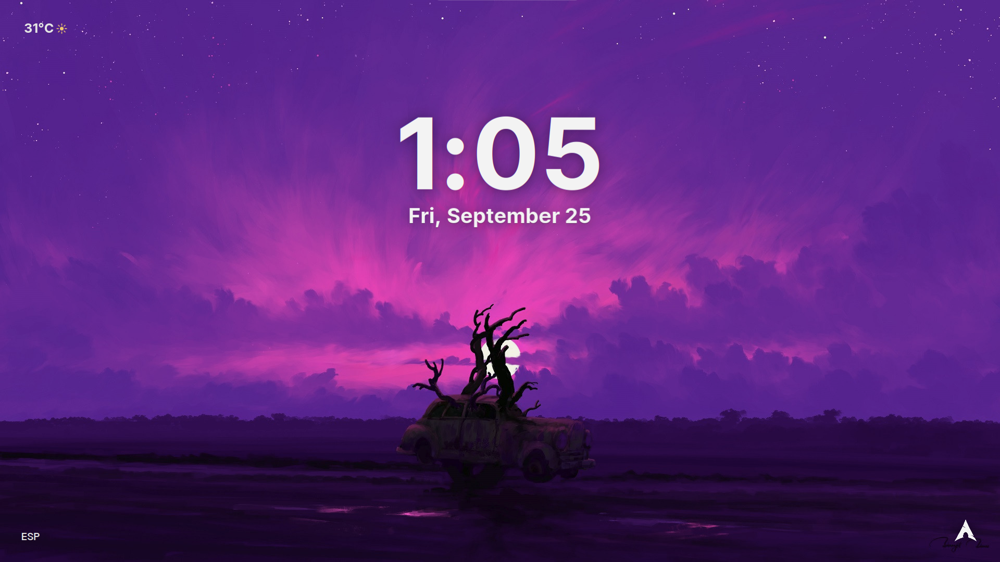
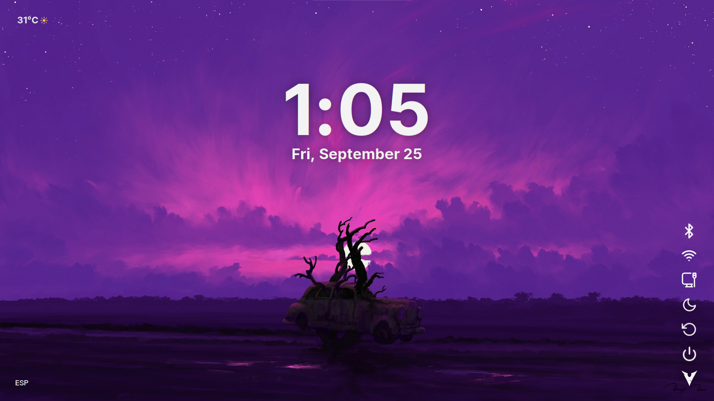

# Glacé Shell

> **A shell for Wayland and KDE Plasma, currently under development (demo)**, with a glassmorphic visual identity built on Qt Quick/QML.

[](LICENSE)
[](https://github.com/Esteban-maker66/GlaceShell/actions/workflows/portability.yml)


Glacé Shell is a Linux desktop configuration and customization project: it centralizes the greeter, the visual interface, graphical assets, system integration scripts, and services in a single repository.

The project's goal is to bring together the complete Linux environment configuration — from the login screen to desktop elements — while maintaining a coherent, fluid, and customizable visual identity.

## Screenshots

### SDDM greeter — current state





The login interface delivered by the project today: clock and date, weather, volume control, battery indicator, language selector, and action dock.

### Desktop shell — under development

Screenshot of the full Wayland/KDE Plasma shell. **Not available yet:** this section will be completed when the desktop shell enters the demo.

<!-- [Glacé Shell desktop shell, under development](docs/screenshots/shell-desktop.png) -->

**Video coming soon.** The demo will be published on the project's YouTube channel and linked here later.

### Videos — coming soon

<!-- The YouTube video URL will be pasted here. GitHub automatically converts it into a player card. -->

*Graphical assets are stored in [`docs/screenshots/`](docs/screenshots/). Videos are hosted outside the repository on purpose: git keeps every file in the history permanently, so an `.mp4` would permanently increase the clone size.*

## Dotfiles scope

A complete dotfiles setup is not limited to copying a theme or a wallpaper. Glacé Shell is planned to serve as a central configuration source and will eventually include:

- **Greeter and login screen:** SDDM theme with QML components, animations, and system information.
- **Visual identity:** wallpapers, fonts, icons, shaders, and design tokens.
- **Desktop configuration:** window compositing, shortcuts, panel or bar, application menu, and related settings.
- **System integration:** scripts and bridges for volume, keyboard, battery, and other services.
- **Automation:** user services, installation, updates, and environment removal.
- **Maintenance:** tools to synchronize changes, validate the configuration, and make recovery easier.

### Implementation status

The current base already contains the SDDM theme, QML components, visual assets, the local IPC bridge, and a portable installer. The complete desktop configuration and several advanced actions are still under development; for now, the project prioritizes defining the architecture and aesthetics that the upcoming components will reuse.

## What characterizes Glacé Shell

- **Glassmorphic aesthetics:** translucent surfaces, rounded shapes, soft contrast, and subtle shadows.
- **Information design:** clock, date, weather, battery, volume, and network status in a clean composition.
- **Purposeful animations:** entry transitions, the dock, the volume bar, and the battery indicator communicate state changes visually.
- **Customization:** wallpapers, custom fonts, and SVG icons that are easy to integrate into the theme.
- **Modular architecture:** every visual element is encapsulated as a reusable QML component.
- **System integration:** reads battery state through `sysfs` via the local bridge, controls volume through PipeWire, reads Wi-Fi/Ethernet state through NetworkManager, and allows changing the keyboard language through a local bridge.
- **Lightweight design:** the interface is built with Qt Quick/QML and communicates with the system through a local service, without depending on a full desktop application.

## Features

- Clock and date with a distinctive typographic hierarchy.
- Local weather through IP geolocation and Open-Meteo.
- Volume bar with drag, wheel, mute, and keyboard-shortcut support.
- Battery indicator with automatic state reading through the local bridge, backed by `/sys/class/power_supply`, on supported devices.
- `ESP`/`ENG` language selector for switching between Spanish and English keyboard layouts.
- Visual quick dock with suspend, restart, power-off, Wi-Fi, and Ethernet actions. Bluetooth is intentionally disabled for the first integration pass; see [limitations](#project-status).
- Transitions between the main view and the login prompt.
- A centered `Press Space to Unlock` hint using the shared chevron, which fades out with the weather and clock when the login view opens.
- Interaction shortcuts: `Enter`/`Space` to show the login, `Esc` to go back, and `Ctrl+Space` to change the language.

## Compatibility

The project is developed and validated on **Arch Linux derivatives**. The table summarizes the expected support according to the user's working environment.

| Distribution | Desktop environment | Status | Notes |
| :--- | :--- | :--- | :--- |
| Arch Linux | KDE Plasma (Wayland) | Tested | Reference development environment. |
| EndeavourOS | KDE Plasma (Wayland) | Tested | Install from the AUR following the same steps as Arch. |
| CachyOS | KDE Plasma (Wayland) | Compatible | Inherits Arch packages; requires `sddm` from the official repositories. |
| Garuda | KDE Plasma (Wayland) | Compatible | Verify that `qt6-wayland` is installed before configuring SDDM. |

Common software requirements for all of them: Qt 6 (Quick/QML), Python 3, PipeWire + WirePlumber, and an SDDM theme installed from the distribution's repositories.

If your combination works and is not listed, or if it fails, [open an issue](https://github.com/Esteban-maker66/GlaceShell/issues) including the distribution, KDE Plasma version, Qt version, compositor, and SDDM version.

## Requirements

- Qt Quick/QML available on the system.
- Python 3 for the IPC bridge.
- PipeWire and WirePlumber, with `wpctl`, for volume control.
- NetworkManager, with `nmcli`, for Wi-Fi and Ethernet state and control.
- `qdbus6`, `hyprctl`, or `setxkbmap` for changing the keyboard layout.
- Internet connection for geolocation and weather forecasts.
- Access to `/sys/class/power_supply` if the battery status is to be displayed.

There is currently no build process: the project is distributed as QML files and assets. The base installer prepares the user configuration and the SDDM theme in the directories defined by XDG.

## Installation

Clone the repository and run the installer from its root:

```sh
git clone https://github.com/Esteban-maker66/GlaceShell.git
cd GlaceShell
./setup/install.sh
```

The installer uses the `XDG_CONFIG_HOME` and `XDG_DATA_HOME` variables, so it does not need to know the user's personal directory. If these are customized, the user service manager must receive the same values.

The installation places the user configuration and IPC service in the configuration directory, prepares the theme in the SDDM data directory, and creates `kxkbrc` only if the user does not already have a configuration. In `sddm.conf`, `ThemeDir` must point to the selected themes directory and `Current` must be `GlaceShell`. If the distribution uses another theme location, it can be specified without modifying the repository. First set `THEME_PATH` to the chosen path and run:

```sh
SDDM_THEME_ROOT="$THEME_PATH" ./setup/install.sh
```

`glace-ipc.service` is a user service. `topVolumeBar` retries the connection every five seconds to survive a late service startup, but the service is not available on the SDDM screen before login. To control the volume from the greeter, a bridge with the greeter's lifecycle must be used, or that control must be removed from the SDDM view.

To uninstall the generated files:

```sh
./setup/uninstall.sh
```

## Documentation

- [Architecture Overview](ARCHITECTURE.md) — separation between the QML frontend and the IPC bridge.
- [Component Specifications](COMPONENT-SPEC.md) — property contract for each component.
- [Style & Design Guidelines](STYLE.md) — code conventions and glassmorphic design tokens.
- [Contributing Guide](CONTRIBUTING.MD) — how to report bugs and submit changes.
- [License](LICENSE) — GPL-3.0-or-later.

## Portability

Resource paths are resolved relative to the QML file that uses them through `Qt.resolvedUrl`. This allows wallpapers, fonts, icons, and components to work both from a local checkout and from an installed theme, without depending on the directory of the person who cloned it.

- `metadata.desktop` uses relative paths for the main script and its configuration.
- The IPC service uses systemd's `%E` and `%t` specifiers instead of hardcoding the home or installation directory.
- The installer determines its root from the repository's own location.
- No personal paths or fixed project installation paths are included.
- Battery reads and local IPC endpoints do not depend on checkout paths or a specific user.
- `BatteryPill` queries the `/battery` endpoint of `glaceBridge`; QML does not read `/sys` through `file://`, so `QML_XHR_ALLOW_FILE_READ` does not need to be enabled.

To verify that the base remains portable, run:

```sh
scripts/maintenance/check-portability.sh
```

The same check runs on every push through the [Portability](.github/workflows/portability.yml) workflow.

## Development and customization

- The greeter entry point is `config/sddm/main.qml`. Visual components are registered in `config/quickshell/components/qmldir`; to use a new one, add its `PascalCase.qml` file and its line in `qmldir`.
- `test/testBench.qml` mounts the components in isolation, without SDDM or the IPC service, for fast UI iteration. Run it with the Qt runtime installed on your system:
  ```sh
  qml6 test/testBench.qml     # Qt 6 (on many distributions, `qml` is still Qt 5)
  qmlscene test/testBench.qml # Qt 5
  ```
  If `qml` shows nothing and ends with *"Did not load any objects"*, it is using the Qt 5 runtime: use `qml6`.
- Modify `config/quickshell/components/BackgroundShader.qml` to change the background, or add fonts in `config/fonts/`.
- Wallpapers in `config/Wallpapers/` are **not versioned**: your collection stays on your machine. Only the default wallpaper used by the shader is versioned. See [`config/Wallpapers/README.md`](config/Wallpapers/README.md).

## Project status

Glacé Shell is in an active development stage. The visual structure, system information, volume control, weather, and language switching are already laid out in the code; the login prompt and some dock actions still need to be completed and tested in different environments.

Known limitations of the current demo:

- **The login prompt is visual only.** Pressing `Enter` or `Space` now slides the clock up and out, diffuses the backdrop with a native Gaussian blur, and reveals a glass panel. It has **no credential fields**: the panel is not wired to SDDM's authentication protocol, and the only way out is `Esc`. Do not use it to log in.
- **The `Ctrl+Space` shortcut may not activate.** The `Shortcut` that invokes `KeyLangBtn.toggleLanguage()` is outside the focused `FocusScope`. Press the `ESP`/`ENG` button directly until it is moved inside the scope.
- **Volume does not work on the SDDM screen.** `glace-ipc.service` is a user service, so it is unavailable before login. `topVolumeBar` retries the connection every five seconds, but controlling the volume from the greeter requires a bridge with the greeter's lifecycle, or removing that control from the SDDM view.
- **Startup shows approximately 1.7 seconds of black screen.** `welcomeOverlay` is an opaque overlay that fades out on entry. This is intentional, but it is worth knowing before assuming that the theme is not starting.
- **The desktop shell does not exist yet.** Everything beyond the greeter is planned, not implemented.
- **Network controls require the IPC bridge.** Suspend, restart, and power-off use SDDM's greeter API. Wi-Fi signal and Ethernet state are polled from `glaceBridge`; because `glace-ipc.service` is a user service, these controls remain hidden on the pre-login SDDM screen until a bridge with the greeter's lifecycle is available. Bluetooth is disabled for now.
- **The IPC bridge does not authenticate.** It listens on `127.0.0.1:18765` without a password, so any local process can change the volume or keyboard layout. This is acceptable for a local bridge, but it is worth knowing.

## License

Glacé Shell is distributed under the **GPL-3.0-or-later** license. See the [LICENSE](LICENSE) file for the complete text.
